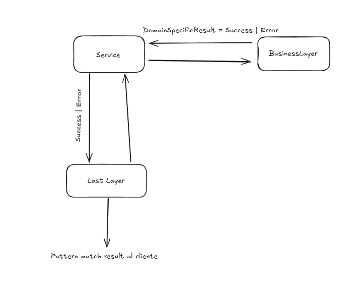

# POC para el manejo de resultados de procesos de negocio


### Esquema general




### Interfaces publicas
```java
// Hacemos una interfaz sealed para limitar que clases implementan la misma, esto es solo para agrupar dos tipos en un mismo conjunto
// Con esto podemos hacer pattern matching sobre los resultados posibles (successful y error)
// Hacemos una interfaz Result por cada dominio así no tenemos un god result object
sealed public interface CharacterLevelUpResult<T> permits CharacterLevelUpError, CharacterLevelUpSuccessfulResult { }

// el objeto Result es solamente un wrapper del objeto de dominio
public record CharacterLevelUpSuccessfulResult (Character data) implements CharacterLevelUpResult<Character> { }

// el objeto errorResult es solamente un wrapper del error de dominio, 
// lo dejamos con generic porque le podemos pasar cualquier error pero bien podriamos hacer T extends ErrorEspecifico1, ErrorEspecifico2...
public record CharacterLevelUpError<T> (T error) implements CharacterLevelUpResult<T> { }
```

Cada proceso debería tener su correspondiente Result interface, de esta manera podemos representar el resultado de cada transacción como un único data type

```java
public CharacterLevelUpResult<?> levelUp(Boolean shouldFail) {
    // representamos un error de negocio en la transacción
    if (shouldFail) {
        var error = new BusinessError("Soy un error");
        // en vez de hacer un throw tiramos un early return con el errorResult
        return new CharacterLevelUpError<>(error);
    }
    level++;
    return new CharacterLevelUpSuccessfulResult(this);
}
```

Para representar la existencia/no existencia simplemente usamos Optional
```java
public Optional<Character> find(String name) {
    // buscamos en la db y no existe
    if (name.equals("notFound")) {
        return Optional.empty();
    }
    return Optional.of(new Character("Fabi", 101, "Paladin"));
}
```

La última capa se encarga de hacer pattern matching para entregar el resultado al cliente

```java
// imaginemos que esto es el controller
public class Main {
    public static void main(String[] args) {
        var service = new CharacterService();

        var result = service.levelUp(true);

        // hacemos pattern matching desde el consumidor para saber que mostrar al cliente
        // En una api mapeamos al ResponseEntity correspondiente
        switch (result) {
            case CharacterLevelUpSuccessfulResult(var data) -> {
                System.out.println("successful result!, this is the data: ");
                System.out.println(data);
            }
            case CharacterLevelUpError(var error) -> {
                System.out.println("error result :(, this is the error data: ");
                System.out.println(error);
            }
            default -> throw new IllegalStateException("Unexpected value: " + result);
        }

        var maybeResult = service.find("notFound");

        // Mapeamos Nothing y Just
        maybeResult.ifPresentOrElse(
                res -> System.out.println("Object found! " + res),
                () -> System.out.println("Object not found :(")
        );
    }
}
```